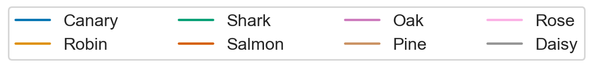

# demo-rumelhart-net

colab: 
- https://colab.research.google.com/drive/1IqYxBfn2wkJwpC-p0SKh7guNYhTzRt2U?usp=sharing
- https://colab.research.google.com/drive/1TzgC1Z9DVc2W-jpgkyDuB-TsQKuLkTe0?usp=sharing

 

The developmental trajectories of item concepts in a neural network model: 

    

        
    
  
    

        
    

